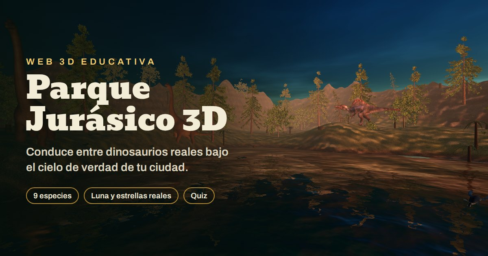
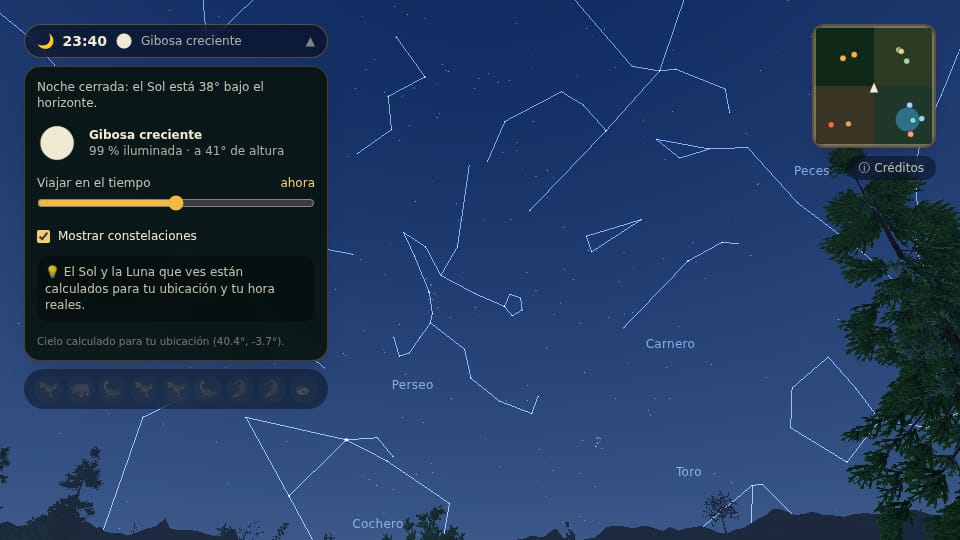
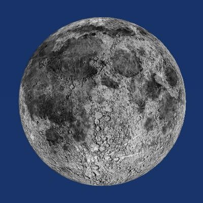
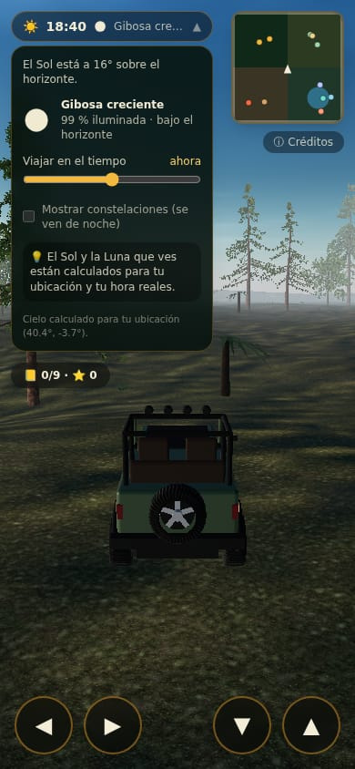
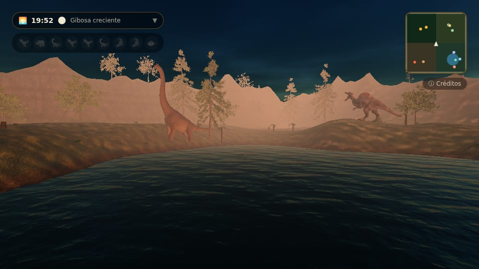
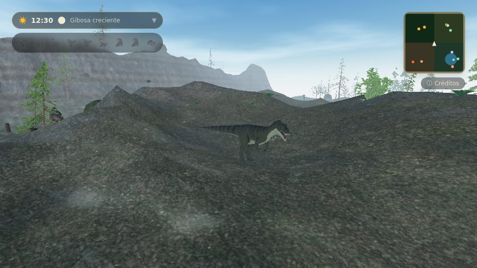
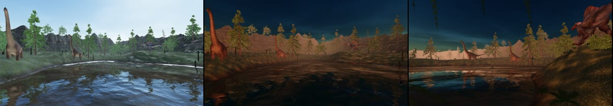
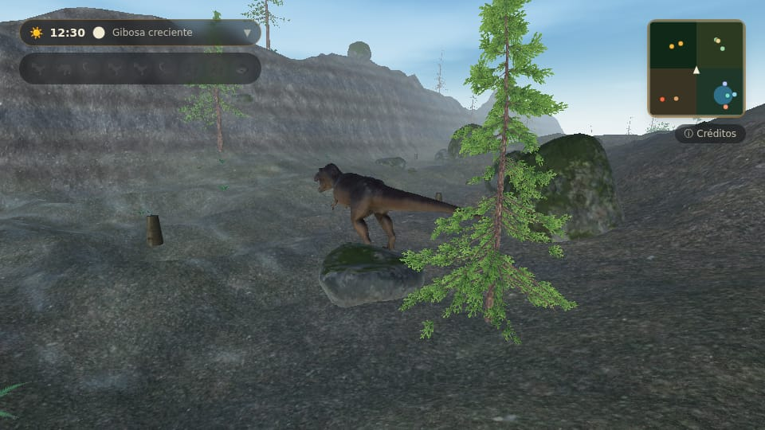
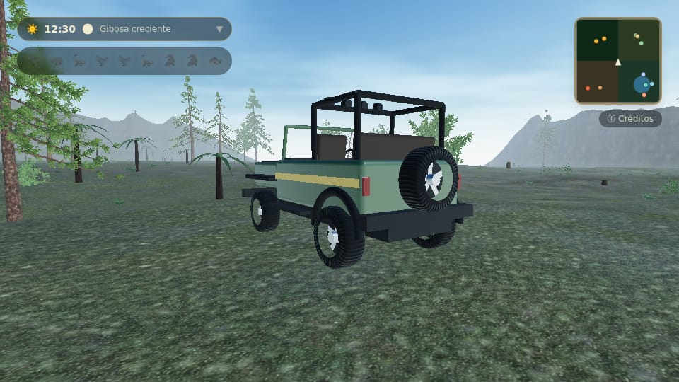
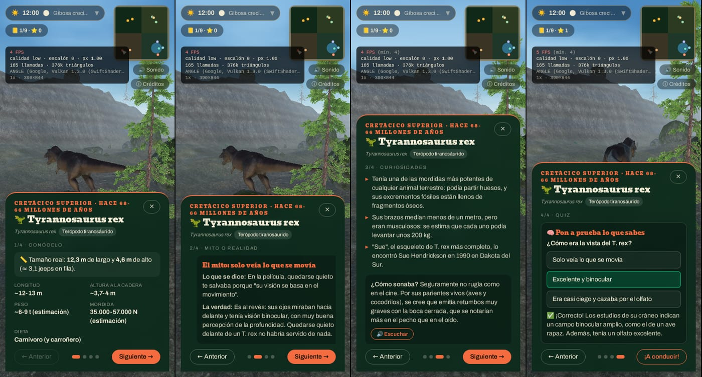

# Un parque de dinosaurios en 3D en el navegador: three.js, astronomía real y una IA a la que hubo que guiar



Conduces un jeep por un parque con flora del Mesozoico, un lago y nueve especies reales (ocho dinosaurios y un reptil marino) a su tamaño real. El cielo es el tuyo: el Sol, la Luna con su fase y las estrellas se calculan para tu ubicación y tu hora. Cada animal tiene una ficha con datos contrastados, un mito del cine desmontado y un quiz. Funciona en el navegador del móvil, sin instalar nada.

Es un proyecto personal que he desarrollado con **Claude Code (modelo Opus 5.5)** como compañero de programación. Este artículo cuenta las decisiones técnicas y también cómo fue trabajar así, con lo bueno y lo malo. Spoiler: no se hizo en cinco minutos y hubo que guiarlo en todo momento.

**Stack:** React 19 + TypeScript + Vite, three.js para el 3D, Framer Motion para la interfaz, SunCalc para la astronomía y Vercel para el despliegue. Sin backend, sin cookies y sin anuncios.

---

## 1. Arquitectura: React para la interfaz, three.js a su aire

La regla principal: **React no toca el bucle de render**. La escena 3D es una clase TypeScript (`GameScene`) que no sabe nada de React. React solo pinta el HUD (fichas, minimapa, panel del cielo) y se comunica con la escena por una API pequeña.

```
src/
  scene/        three.js puro: GameScene, cielo, terreno, agua, vegetación, dinosaurios, jeep
  components/   HUD en React + Framer Motion
  hooks/        useGame: el puente React ↔ escena
  data/         fichas, textos educativos y créditos
```

- **El input va por una ref mutable.** El teclado y los botones táctiles escriben en un objeto que la escena lee en cada frame. Así no hay renders de React por cada tecla.
- **La escena se carga con `import()` dinámico.** three.js no entra en el bundle inicial: la pantalla de entrada pesa **119 KB comprimidos** y el chunk 3D (**195 KB comprimidos**) se descarga mientras lees el cartel de bienvenida. Los modelos (~4 MB en total) se cargan después, en paralelo.
- **Los componentes de React solo importan tipos de la escena** (`import type`). Un solo `import` normal desde un componente (me pasó con el minimapa) arrastra three.js entero al bundle inicial.

## 2. Un cielo real: Sol, Luna y estrellas de tu ubicación



### Sol y Luna

SunCalc da la altura y el acimut del Sol y de la Luna para una fecha y unas coordenadas. Ojo: **en la versión 2 los ángulos van en grados y el acimut se mide desde el norte**, al revés que en la versión 1 (radianes y desde el sur). El primer cálculo salió con el Sol a −2.344°.

Con eso se construye el vector hacia el Sol en coordenadas del mundo (+X este, −Z norte, +Y arriba) y se lo pasamos al `Sky` de three.js, que simula la dispersión atmosférica. El propio cielo genera un mapa de entorno (PMREM) para iluminar los materiales PBR, y solo se regenera cuando el Sol se ha movido algo.

### La fase lunar sale gratis

No hay ninguna tabla de fases. La Luna es una esfera con textura, colocada en su posición real, y se ilumina desde la dirección real del Sol:

```glsl
// La fase sale sola: el hemisferio lunar iluminado es el que mira al Sol real.
float lit = smoothstep(-0.03, 0.12, dot(normalize(vNormalWorld), uSunDir));
```

Si la geometría es correcta, la fase es correcta: creciente, llena, menguante… y además se ve "girada" desde el hemisferio sur.



### Estrellas reales que giran con la hora sidérea

Las ~2.800 estrellas (hasta magnitud 5,5) y las 88 constelaciones vienen del catálogo de d3-celestial, reducido a un JSON de 85 KB. Cada estrella se guarda como vector en coordenadas ecuatoriales y una sola matriz 3×3 las lleva al cielo local en el vertex shader. La matriz depende del **tiempo sidéreo local** y de la latitud:

```ts
function equatorialToWorldMatrix(date: Date, latDeg: number, lonDeg: number): number[] {
  const lst = localSiderealTime(date, lonDeg)
  const phi = (latDeg * Math.PI) / 180
  const cL = Math.cos(lst), sL = Math.sin(lst)
  const cP = Math.cos(phi), sP = Math.sin(phi)
  // Rz(-LST): de ascensión recta a ángulo horario.
  const r = [[cL, sL, 0], [-sL, cL, 0], [0, 0, 1]]
  // De marco horario a mundo: x = este, y = cenit, z = sur.
  const h = [[0, 1, 0], [cP, 0, sP], [sP, 0, -cP]]
  // ...producto h·r en column-major para three.js
}
```

Para validarla usé la Polar: desde Madrid tiene que salir a unos 40° de altura y exactamente al norte. Y así sale.

Un panel en el HUD permite **viajar en el tiempo** (±12 h) para ver el atardecer o la noche sin esperar. La geolocalización se pide al pulsar "Arrancar", nunca al cargar la página, y la ubicación no sale del navegador.



## 3. Terreno, lago y flora del Mesozoico



- **Terreno:** ruido fBm con amplitudes distintas por zona (llanura suave, cañones con ruido "ridged"), una cuenca excavada para el lago y una cordillera en el perímetro que cierra el mapa de forma natural.
- **Material:** un `MeshStandardMaterial` con `onBeforeCompile` que mezcla musgo, tierra, arena de orilla y una roca sedimentaria con **estratos** generados en el shader, como en los cañones donde aparecen fósiles.
- **Flora:** coníferas y árboles de hoja ancha generados con EZ-Tree y guardados como GLB. Helechos, helechos arborescentes y cícadas diseñados por procedimiento, con las frondas dibujadas en un canvas. En el Jurásico no había praderas de hierba, así que no hay hierba. Todo se mueve con el viento en el vertex shader.



### Rendimiento de la vegetación

Miles de plantas con `InstancedMesh`. Un solo `InstancedMesh` por tipo tiene un problema: su esfera envolvente cubre todo el mapa, así que nunca se descarta. Ni para la cámara ni para la sombra. **Partir cada tipo en trozos de 75 m** hace que three.js descarte los que no se ven. Además, los detalles pequeños (helechos, rocas) van en una capa que el reflejo del lago no dibuja.

### Tres bugs que merece la pena contar

1. **`THREE.MathUtils.smoothstep` no admite bordes invertidos.** `smoothstep(x, 1.5, 1.0)` devuelve 0 siempre, a diferencia del de GLSL. El lago "existía", pero la cuenca nunca se excavaba. La solución fue una función propia:

   ```ts
   export function smooth(x: number, a: number, b: number): number {
     const t = Math.min(1, Math.max(0, (x - a) / (b - a)))
     return t * t * (3 - 2 * t)
   }
   ```

2. **`gltf-transform optimize` borra las UV si el material no tiene texturas.** Los árboles exportados sin textura (se la ponía después en código) se quedaron sin coordenadas UV y, por tanto, sin hojas. Se evita con `--prune-attributes false`.

3. **El agua reflectante salía negra en calidad alta.** `Water` de three.js calcula el plano del espejo con el eje +Z *local del objeto*. Yo había girado la geometría (`geometry.rotateX`) en vez del objeto (`mesh.rotation.x`), así que el espejo quedaba vertical y nunca se pintaba. Lo detectamos leyendo los píxeles del render target del reflejo: todo ceros.



## 4. Dinosaurios: modelos reales, tamaño real y un andar hecho en shader



### Modelos y licencias

Los nueve modelos son **CC BY 4.0** de artistas de Sketchfab, con la licencia comprobada en los metadatos del GLB. Hubo que descartar varios "gratis" que en realidad estaban **extraídos de videojuegos** (Jurassic World Evolution, Dino Hunter, Walking with Dinosaurs): el que los sube no tiene derecho a licenciarlos. Todos pasan por `gltf-transform` (Meshopt + texturas WebP de 1024 px) y se quedan entre 230 y 730 KB.

### Tamaño real

Cada ficha tiene el largo y el alto reales, y el modelo se escala a ellos. Como los modelos no siempre tienen las proporciones exactas, se usa la **media geométrica** de las dos escalas, que reparte el error. El jeep mide 4 m, así que la ficha puede decir "≈ 3 jeeps en fila". El Velociraptor, por cierto, era del tamaño de un pavo.

Otro bug interesante: tres modelos salían **diminutos**. Eran `SkinnedMesh` exportados desde FBX con el esqueleto a escala 0,01. La caja envolvente usaba la pose del esqueleto, pero al "hornear" la geometría se ignoraba. La solución fue aplicar la pose con `getVertexPosition` antes de hornear.

### Andar procedural en el vertex shader

Solo tres modelos traían animación. Para el resto escribí un rig procedural que analiza la geometría (dónde apoyan los pies, a qué altura se unen las patas al cuerpo) y deforma los vértices en el shader:

```glsl
vec3 swingLeg(vec3 p, float legZ, float phase, float weight) {
  float legPhase = phase + (sign(weight) > 0.0 ? 0.0 : 3.14159);
  // Rodilla: en la fase de avance la parte baja se dobla y el pie se levanta.
  float flex = max(0.0, cos(legPhase)) * 0.75 * uStride * abs(weight);
  vec2 zy = rotateAround(p.zy, vec2(legZ, KNEE_Y), -flex * lowerLegWeight(p.y));
  // Cadera: la pata entera pendula adelante y atrás.
  zy = rotateAround(zy, vec2(legZ, HIP_Y), sin(legPhase) * 0.42 * uStride * abs(weight));
  return vec3(p.x, zy.y, zy.x);
}
```

Además, la cola se balancea al ritmo de los pasos, la cadera carga el peso, el cuerpo se curva al girar y los herbívoros bajan la cabeza a comer. Para que **los pies no patinen**, la cadencia se calcula con la geometría: con un péndulo de ±0,42 rad, el pie recorre 2·sen(0,42)·altura ≈ 0,82·altura en cada apoyo, así que un ciclo completo avanza 1,63 veces la altura de la pata.

## 5. Física del jeep: propia y ligera

Me planteé un motor de física. Medí los tamaños: **Rapier (versión web) pesa unos 1,6 MB comprimido; cannon-es, unos 36 KB**. Para un jeep sobre un terreno con obstáculos circulares no hacía falta ninguno. La física propia son unos pocos KB:

- Velocidad 2D con inercia y **agarre lateral** de los neumáticos, que derrapan un poco en curvas rápidas:
  ```ts
  vSide *= Math.exp(-TIRE_GRIP * (1 - 0.6 * slipFactor) * dt)
  const yawTarget = (vForward / WHEELBASE) * Math.tan(this.steer) // Ackermann simplificado
  ```
- Pendientes que frenan o empujan, y gravedad: en una cresta rápida el jeep se despega.
- Choques con rebote (restitución 0,3) contra troncos, rocas y dinosaurios, usando una rejilla espacial para no recorrer cientos de obstáculos por frame.
- Carrocería sobre **muelles amortiguados**: se agacha al acelerar, cabecea al frenar y se inclina en las curvas.



## 6. Rendimiento en móvil: medir en lugar de adivinar

- **Presets de calidad** por dispositivo: menos vegetación, sin sombras y agua sin reflejo en móviles modestos. En calidad alta la escena ronda los **2,1 millones de triángulos**; en baja, unos **0,5 millones**.
- **Calidad adaptativa:** tras unos segundos de calentamiento se miden los FPS reales. Si no llegan a 40, se baja un escalón: primero la resolución, luego las sombras y el reflejo, y por último la distancia de dibujado.
- **`?debug=1`** muestra un panel con FPS, FPS mínimo, triángulos, llamadas de dibujo y GPU, para probar en móviles reales y hacer una captura.
- **Vercel Speed Insights** mide la carga en los dispositivos de quien visita la web.

## 7. Interfaz educativa

Las fichas empezaron siendo un bloque de texto que en el móvil cortaba el quiz. Ahora son **cuatro pasos cortos** (Conócelo, Mito o realidad, Curiosidades y Quiz) con botones, gestos de deslizar y flechas del teclado. Cada paso cabe en una pantalla de 390×844 sin desplazar.



## 8. Sonido: lo que no salió

Probamos voces de dinosaurio sintetizadas con Web Audio: retumbos, bramidos, gruñidos de cocodrilo. Técnicamente funcionaban, pero **sonaban todas parecidas y ninguna a animal**. Las quitamos. Solo queda el motor del jeep (el tono sube con la velocidad) y un golpe al chocar cuyo volumen depende de la fuerza del impacto. Para voces creíbles harían falta grabaciones reales de animales mezcladas, como hace el cine.

## 9. Privacidad sin esfuerzo extra

- **Sin cookies.** Vercel Web Analytics y Speed Insights no las usan.
- **Fuentes alojadas en el propio sitio** (@fontsource) en lugar de Google Fonts.
- **La ubicación solo se usa en el navegador** y se pide con un gesto del usuario.
- Página de privacidad estática y créditos de cada recurso.

---

## 10. Trabajar con IA: lo bueno, lo malo y lo que puse yo

### Cómo trabajamos

- Claude Code trabajaba en un contenedor en la nube conectado a mi repositorio de GitHub.
- **Nunca subía a `main`:** cada cambio iba en una rama con su PR, y yo revisaba y fusionaba.
- En el repo hay un `CLAUDE.md` con las normas del proyecto y *skills* propias: capturas con Playwright, proceso para añadir modelos 3D, rigor en los textos y cómo llevar una PR.
- Un hook de arranque instala las dependencias en cada sesión.

### Lo bueno

- **Velocidad en lo que no domino.** Matrices de astronomía, shaders de deformación, formatos glTF cuantizados… Me habría costado semanas documentarme.
- **Buenas PRs.** Descripciones claras de qué cambia, por qué y cómo se ha verificado.
- **Pruebas propias.** Capturas automáticas de cada dinosaurio, del día y de la noche, pruebas de conducción y análisis del audio generado. Así encontró bugs serios, como el del agua negra.

### Lo malo

- **No ve ni oye como una persona.** El entorno no tenía tarjeta gráfica ni altavoces: renderizaba a 4–6 FPS por software. No podía juzgar la fluidez real ni si un sonido "suena bien", y por eso las voces llegaron hasta mi revisión.
- **Las primeras versiones eran flojas.** Dinosaurios de juguete hechos con cajas, una noche tan oscura que no se veía nada, fichas que se cortaban en el móvil. Cada mejora llegó porque la pedí.
- **Se equivoca con seguridad.** Los bugs de este artículo los introdujo él y los encontró después, no a la primera.
- **Hay que vigilar lo que no es código.** Modelos con licencias falsas, un nombre de proyecto que es marca registrada y, al principio, commits firmados por la IA cuando yo había pedido que no. Lo arreglamos con una configuración del repositorio que fija la autoría.

### Lo que puse yo como informática

- **Flujo de Git profesional:** rama principal protegida, una PR por tema, revisión antes de fusionar.
- **Criterio técnico:** descartar Unity para una web ligera, descartar un motor de física de 1,6 MB y pedir que las cosas se midieran.
- **Producto y usuario:** móvil primero, fichas legibles, quitar lo que no aporta (las voces) aunque "funcione".
- **Privacidad y legalidad:** licencias, créditos, sin cookies y permisos pedidos en el momento adecuado.
- **Probar en dispositivos reales**, que es justo lo que la IA no puede hacer.

**Conclusión:** la IA no sustituye saber programar; multiplica lo que ya sabes. Sin criterio sobre Git, arquitectura, rendimiento o privacidad, habría aceptado resultados a medias sin darme cuenta. Con esa base, un proyecto así pasa de meses a días.

---

## Créditos

Modelos de dinosaurios CC BY 4.0 de Marcel Schanz, MrTomas, wojciechmiedziocha, IagoMendez, seirogan, kenchoo, Saurus, dinoguy263allo y ricksticky. Árboles: EZ-Tree (MIT). Cielo y agua: three.js (MIT). Estrellas: d3-celestial (BSD-3). Posición del Sol y la Luna: SunCalc (BSD-2). La lista completa, con enlaces, está en la pantalla de créditos de la web.
